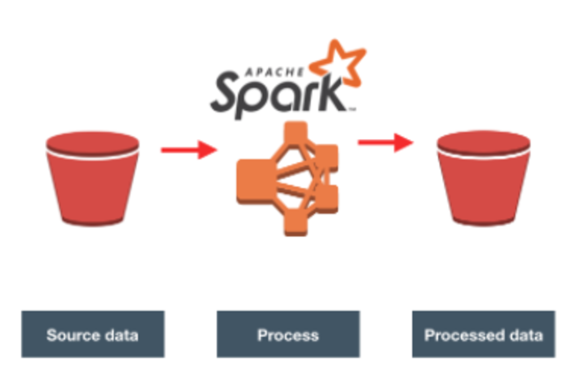

Cloud Data Warehouses-redshift
==========================================
## Table of contents

1.Goal

2.Solution

3.Project Datasets

4.File Description

5.Schema for Song Play Analysis

6.Instructions

## Goal

A music streaming startup, Sparkify, has grown their user base and song database and want to move their processes and data onto the cloud. Their data resides in S3, in a directory of JSON logs on user activity on the app, as well as a directory with JSON metadata on the songs in their app.

In this project 4, we are going to apply what we've learned on Spark and data lakes to build an ETL pipeline for a data lake hosted on S3. To complete the project, we will need to load data from S3, process the data into analytics tables using Spark, and load them back into S3. we'll deploy this Spark process on a cluster using AWS.

## Solution

## Project Datasets

There are two datasets that reside in S3. Here are the S3 links for each:

Song data: s3://udacity-dend/song_data
Log data: s3://udacity-dend/log_data
Log data json path: s3://udacity-dend/log_json_path.json

* Song Dataset

-song_data/A/B/C/TRABCEI128F424C983.json
-song_data/A/A/B/TRAABJL12903CDCF1A.json

And below is an example of what a single song file, TRAABJL12903CDCF1A.json, looks like.

-{"num_songs": 1, "artist_id": "ARJIE2Y1187B994AB7", "artist_latitude": null, "artist_longitude": null, "artist_location": "", "artist_name": "Line Renaud", "song_id": "SOUPIRU12A6D4FA1E1", "title": "Der Kleine Dompfaff", "duration": 152.92036, "year": 0}

* Log Dataset

-log_data/2018/11/2018-11-12-events.json
-log_data/2018/11/2018-11-13-events.json
below is an example of what the data in a log file, 2018-11-12-events.json, looks like

## File Description

- dl.cfg : aws credentials

- etl.py : helper functions to process all Json files and datasets from S3 bucket.

- README.md is  providing discussion on your process and decisions for this ETL pipeline

## Schema for Song Play Analysis

*Fact Table

songplays - records in event data associated with song plays i.e. records with page NextSong

songplay_id, start_time, user_id, level, song_id, artist_id, session_id, location, user_agent

*Dimension Tables

users - users in the app
user_id, first_name, last_name, gender, level

songs - songs in music database
song_id, title, artist_id, year, duration

artists - artists in music database
artist_id, name, location, lattitude, longitude

time - timestamps of records in songplays broken down into specific units
start_time, hour, day, week, month, year, weekday

## Instructions

1.Fill in the requiered credentials in dl.cfg file.

2.open the terminal

3.run etl.py -> python etl.py

4.get some coffee, it will take some time to preceed with process.