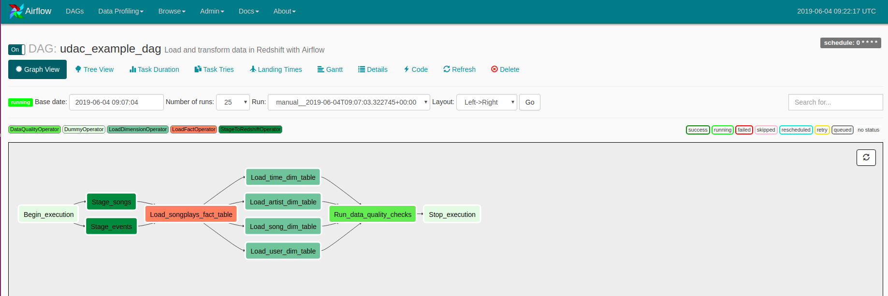
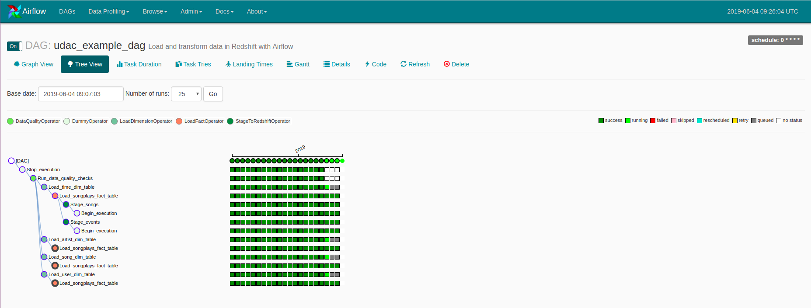

Data Pipelines with Apache Airflow
==========================================
## Table of contents

1.Goal

1-1 results sample

2.Project Datasets

3.File Description

4.Schema for Song Play Analysis

5.Instructions

## Goal

A music streaming startup, Sparkify, has grown their user base and song database even more and want to move their data warehouse to a data lake. Their data resides in S3, in a directory of JSON logs on user activity on the app, as well as a directory with JSON metadata on the songs in their app

As their data engineer, I was responsible for automating the ETL pipelines through Airflow, extracting data from S3, loading data into staging tables and transforming the data into a star schema stored in Amazon Redshift. The data warehouse (automatically generated by the Airflow tasks) were then validated using custom analyses to detect any discrepancies in the databases. Skills include:

* Using Airflow to automate ETL pipelines using Airflow, Python, Amazon Redshift.

* Transforming data from various sources into a star schema optimized for the analytics team's use cases.

* Writing custom operators to perform tasks such as staging data, filling the data warehouse, and validation through data   quality checks.

* Setting up IAM Roles, Redshift Clusters, Airflow Connections.

Dag Flow

Dag Iterative Results Sample

- Results sample

 Dag Flow

 Dag Iterative Results Sample 

## Project Datasets

There are two datasets that reside in S3. Here are the S3 links for each:

Song data: s3://udacity-dend/song_data
Log data: s3://udacity-dend/log_data
Log data json path: s3://udacity-dend/log_json_path.json

* Song Dataset

-song_data/A/B/C/TRABCEI128F424C983.json
-song_data/A/A/B/TRAABJL12903CDCF1A.json

And below is an example of what a single song file, TRAABJL12903CDCF1A.json, looks like.

-{"num_songs": 1, "artist_id": "ARJIE2Y1187B994AB7", "artist_latitude": null, "artist_longitude": null, "artist_location": "", "artist_name": "Line Renaud", "song_id": "SOUPIRU12A6D4FA1E1", "title": "Der Kleine Dompfaff", "duration": 152.92036, "year": 0}

* Log Dataset

-log_data/2018/11/2018-11-12-events.json
-log_data/2018/11/2018-11-13-events.json
below is an example of what the data in a log file, 2018-11-12-events.json, looks like

## File Description

- dl.cfg : aws credentials

- etl.py : helper functions to process all Json files and datasets from S3 bucket.

- README.md is  providing discussion on your process and decisions for this ETL pipeline

## Schema for Song Play Analysis

*Fact Table

songplays - records in event data associated with song plays i.e. records with page NextSong

songplay_id, start_time, user_id, level, song_id, artist_id, session_id, location, user_agent

*Dimension Tables

users - users in the app
user_id, first_name, last_name, gender, level

songs - songs in music database
song_id, title, artist_id, year, duration

artists - artists in music database
artist_id, name, location, lattitude, longitude

time - timestamps of records in songplays broken down into specific units
start_time, hour, day, week, month, year, weekday

## Instructions

When you are in the workspace, after completing the code, you can start by using the command : /opt/airflow/start.sh

Once you done, it would automatically start all the dags required and outputting the result to its respective tables
